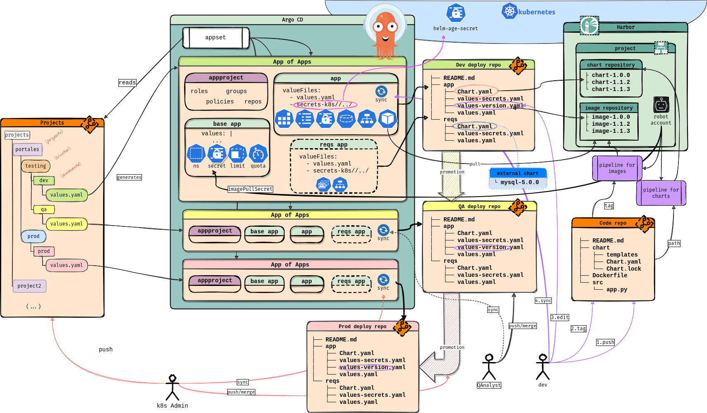
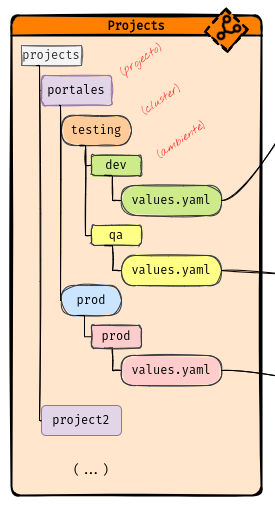
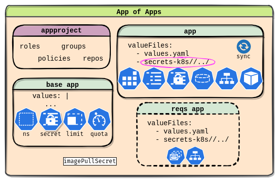
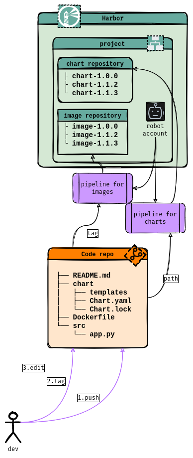
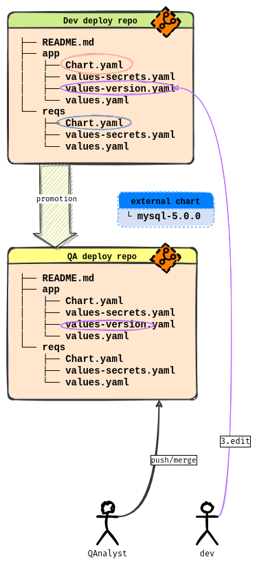

# El flujo de trabajo

El siguiente gráfico muestra todas las componentes que intervienen en el flujo,
así como además sus interacciones.



Como puede verse, son muchas las componentes que aparecen. Para comprender el
flujo comenzamos entonces por el la génesis del mismo, el **ApplicationSet**.

## ApplicationSet

El ApplicationSet es la entidad blanca dentro del del recuadro de **ArgoCD** de
nuestro gráfico. En la sección [repositorios de Git](./git-repositories.md),
mencionamos cómo podría ser su manifiesto. Este recurso es el responsable de
crear las aplicaciones ArgoCD que separan las etapas de **configuración del
ambiente** respecto del **despliegue de aplicaciones**.

{ align=right }
Para ello, en el ejemplo proporcionado utilizamos el generador basado en Git
para que las aplicaciones a crear dependan de la existencia de un archivo
**`values.yaml`** bajo una estructura de directorios. En el gráfico,
esta estructura está bajo la carpeta `projects/`. Los nombres de los directorios
intermedios es muy relevante, porque indican el nombre del proyecto, el cluster
de despliegue y su ambiente. Todos los nombres compondrán el nombre de la
aplicación ArgoCD, por ejemplo: **portales-testing-dev**.

La aplicación se crea a partir de un Helm Chart que, como se muestra en el
[ejemplo que acompaña el flujo](https://github.com/Mikroways/argo-gitops-demo-example/tree/main/charts/custom-argo-project),
es una carpeta dentro del mismo repositorio donde están los proyectos. Esta
carpeta, es un Helm Chart wrapper que depende de [mikroways/argo-project](https://github.com/Mikroways/argo-gitops-flow/tree/main/charts/argo-project).
Este chart crea el proyecto en ArgoCD, el namespace, prepara el ambiente con los
límites mencionados anteriormente y finalmente despliega opcionalmente las
aplicaciones.

Debido al [CVE](https://cve.mitre.org/cgi-bin/cvename.cgi?name=CVE-2022-24348),
puede observarse que dentro del chart, aparece un link simbólico a la carpeta
donde están los proyectos.

!!! tip
    Esto puede solucionarse a partir de ArgoCD 2.6 usando [múltiples
    repositorios git para los valores](https://argo-cd.readthedocs.io/en/stable/user-guide/multiple_sources/#helm-value-files-from-external-git-repository).

## Cifrado de datos sensibles

Debido a que la aplicación creada en el paso anterior utiliza el `values.yaml`
bajo la estructura de proyectos, pudiendo setear datos sensibles como es el caso
de repositorios privados de ArgoCD o las credenciales para descargar imágenes de
contenedores desde registries privadas, el ApplicationSet utiliza en las
aplicaciones generadas:

```yaml
  valueFiles:
    - secrets+age-import-kubernetes://argocd/helm-secrets-age-private-key#key.txt?{{path}}/values.yaml
```

De esta forma, los valores pueden o no estar cifrados usando [helm
secrets](https://github.com/jkroepke/helm-secrets), que en nuestro ejemplo
utilizamos con [sops](https://github.com/mozilla/sops) y
[age](https://github.com/FiloSottile/age). De hecho, en el ejemplo propuesto
explicamos [cómo trabajar con Age y
Sops](https://github.com/Mikroways/argo-gitops-demo-example/tree/main/projects#configurando-las-claves-para-poder-cifrar-valores).

## El patrón App of Apps

Si bien consideramos que el uso del [patron App of Apps](https://argo-cd.readthedocs.io/en/stable/operator-manual/cluster-bootstrapping/#app-of-apps-pattern)
puede ser confuso, su potencial es indiscutible. Nosotros lo utilizamos en el
chart [mikroways/argo-project](https://github.com/Mikroways/argo-gitops-flow/tree/main/charts/argo-project),
creando tres aplicaciones:

* **baseApplication:** crea el namespace con las políticas impuestas por los
  administradores. Es obligatoria.
* **applicationRequirements:** aplicación ArgoCD que desplegará los
  requerimientos del despliegue. Su uso es opcional.
* **application:** aplicación ArgoCD que desplegará las componentes principales
  del despliegue. Su uso es opcional.



## Uso de repositorios y registries

{ align=right }
Para hacer un uso adecuado del flujo, las aplicaciones antes nombradas:
application y applicationRequirements, serán aplicaciones wrapper que se crearán
como aplicaciones que dependerán del chart real que represente ese despliegue.
Para ello, será necesario utilizar alguna plataforma donde se puedan almacenar
los charts empaquetados, como por ejemplo [Harbor](https://goharbor.io/),
[Artifact Hub](https://github.com/artifacthub/hub) o alguna registry oci.

El gráfico muestra cómo los desarrolladores codifican en un repositorio Git que,
a través de pipelines terminan publicando en Harbor, imágenes de contenedores y
charts. Acá puede verse en práctica la separación de responsabilidades: los
desarrolladores trabajan simplemente con el código. Generan nuevas versiones de
producto/chart cuando se accionan los pipelines. Acá los permisos para hacerlo,
dependen meramente de la plataforma de Git.

Los charts que se publican, nada dicen del despliegue en un ambiente. Únicamente
se encargan de plantear cómo se parametrizan las configuraciones para el
correcto funcionamiento de la aplicación. Al haber un chart por cada aplicación,
la integración de varias componentes de software queda supeditada a otra
instancia. La instancia propia del despliegue que integrará todas las
componentes.

Las registries de contenedores por su parte, serán privadas para muchas
organizaciones. El paso previo entonces, es decir el de armado del ambiente,
provee una facilidad que permite configurar las credenciales para que el
despliegue pueda configurar el imagePullSecret.

## Repositorio de despliegue

{ align=right }
Y el paso más importante del flujo de GitOps, es el que nos queda por
describir. Es el repositorio que representará la aplicación propiamente dicha a
desplegar. Incluso la aplicación que represente los requisitos previos que deben
existir con antelación. Para este paso, proponemos el uso de un repositorio Git
que representará un helm chart wrapper porque dependerá de cada componente de
software.

!!! question "¿Cuáles son esas componentes?"
    Si el despliegue considera por ejemplo un backend y un frontend, ya tenemos
    dos charts que deben integrarse.

La idea es que quienes accedan al repositorio tengan acceso a ArgoCD como
administradores del proyecto. La razón es que serán ellos quienes dictan la
verdad del despliegue en el ambiente. Decimos chart wrapper, porque no tendrá
manifiestos, únicamente dependerá de cada chart que componga la solución. Como
muestra el gráfico, es posible usar un mismo repositorio para representar la
aplicación a desplegar y sus requerimientos, o dos repositorios independientes.
serán los reponsables de modificar el despliegue

En el ejemplo propuesto, [mostramos varios
escenarios](https://github.com/Mikroways/argo-gitops-demo-example/tree/main/projects#despliegues-con-el-marco-de-trabajo),
pero podemos tomar a modo de ejemplo, el caso de [un despliegue basado en un
chart privado](https://github.com/Mikroways/argo-gitops-private-template/tree/main/gitops-private-chart).

## Ejemplos que ayudan a comprender el flujo

Para poder comprender el funcionamiento del flujo, hemos dispuesto un
[repositorio template en GitHub](https://github.com/Mikroways/argo-gitops-demo-example/).
El README del repositorio documenta cuáles son los pasos a seguir para replicar
el ambiente, creando un cluster Kubernetes basado en
[kind](https://kind.sigs.k8s.io/), donde se desplegará ArgoCD con una serie de
servicios que permiten evidenciar el flujo con ejemplos concretos. Además del
repositorio, es importante tomar conocimiento de los charts que dan vida al
flujo:

* [mikroways/argo-project](https://github.com/Mikroways/argo-gitops-flow/tree/main/charts/argo-project)
* [mikroways/argo-base-app](https://github.com/Mikroways/argo-gitops-flow/tree/main/charts/argo-base-app)

Luego, las aplicaciones que se desplegarán mostrarán una serie de escenarios que
se apoyan en [otro repositorio también
template](https://github.com/Mikroways/argo-gitops-private-template),
que conviene versionarlo de forma privada tanto en GitHub como GitLab para
completar pruebas con ambas plataformas.
